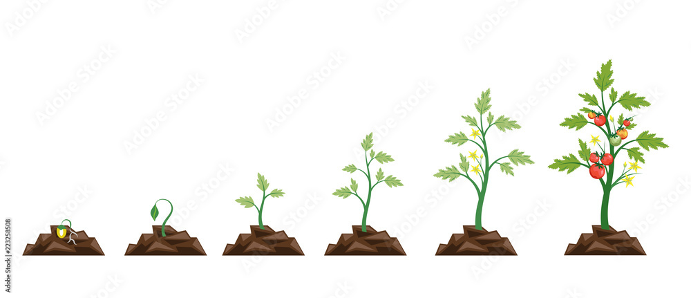

# [simple-plant-growth-visualiser-js](https://zackakil.github.io/simple-plant-growth-visualiser-js/)
## [play with demo](https://zackakil.github.io/simple-plant-growth-visualiser-js/)
What if bar charts had a more realistic sense of ideal growth target, like say... get a plant to fruit?

I build a simple vue component that takes as input a number from 1 to 5 and then displays a stage of a plant taken from a single image (sprite sheet technique).
